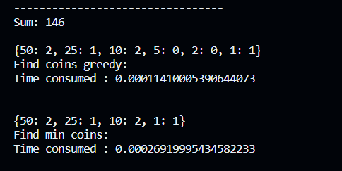
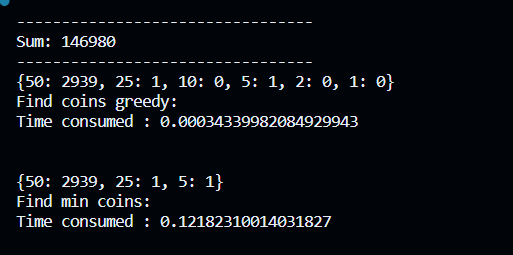
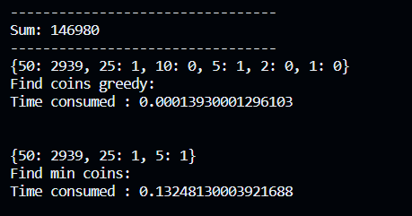

## Порівняння **жадібного алгоритму** та **алгоритму динамічного** програмування на прикладі задачі із монетами
Перевіряємо спершу обидва алгоритми на маленькій сумі. Видно, що працюють обидва методи коректно  
  
При збільшенні суми спостерігаємо наступне:  
  
При алгоритмі динамічного програмування дана задача виконуються набагато довше, якщо порівнювати із жадібним алгоритмом, що, насправді, не дивно. Алгоритму динамічного програмування необхідно витратити доволі багато ресурсів на створення таблиці, заповнення, підбір значень а потім відбір потрібних значень, поки жадібний алгоритм швидко сортує номінали монет і з них підбирає необхідні, починаючи з найменшого та закінчуючи найбільшим. Дана задача навіть скоротила б час, якби замість віднімання ми використовували ділення з остачею:  

